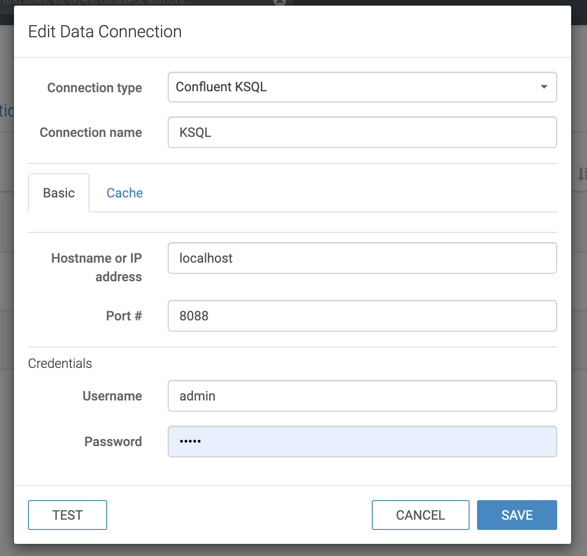
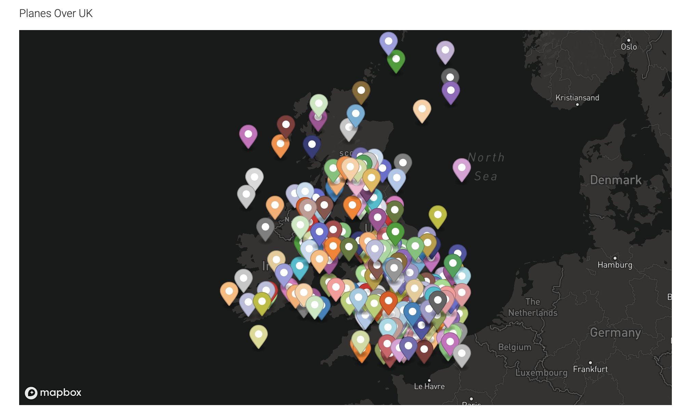

# Flights KSQL

This repository ingests data from the [OpenSky Network](http://opensky-network.org/) API into Kafka, and makes the data available through KSQL for Arcadia Instant to use.

It does this locally with Docker Compose plus a local Arcadia Instant installation.  It will cost nothing to run this, but the Arcadia Instant download is behind an email wall.

This has only been tested on a Mac.

## Setup

Spin up the Confluent stack (Zookeeper, Kafka, Schema Registry, KSQL Server, Kafka REST Proxy) using Docker Compose:
 
```bash
docker-compose up
```

This will take a while to run, especially the first time when it has to download Docker images.  Once the output stops you can carry on in a separate terminal.

Install the dependencies for the ruby script (HTTParty and a REST Proxy client gem):

```bash
bundle install
```

Run the ingest script to bring in flights from the OpenSky Network:

```bash
bundle exec ruby ingest.rb
```

You should see an output similar to `INFO: Publishing 312 messages to topic FlightState` if this is successful.

Connect to KSQL CLI:

```bash
docker run --network flights-ksql_default --rm --interactive --tty confluentinc/cp-ksql-cli http://ksql-server:8088
```

And then create streams and tables from this data:

```sql
CREATE STREAM FlightStateStream WITH (KAFKA_TOPIC='FlightState', VALUE_FORMAT='AVRO');
CREATE TABLE Planes WITH (KAFKA_TOPIC='FlightState', VALUE_FORMAT='AVRO', KEY='icao24');
exit
```

You should see a `Stream created` and a `Message created` output from this.

You can now run the ingest every few seconds to ensure data is coming through:

```bash
watch -n 10 bundle exec ruby ingest.rb
```

## Arcadia Data

Launch Arcadia Instant, start the server, and launch a browser.

Click on the `Data` tab at the top.

Click on the `NEW CONNECTION` button at the top left and create a new Confluent KSQL connection called KSQL as follows (the password is `admin`):



Click on the `...` button, and `Import Visual Artifacts`.

Import [this file](images/visuals.json).

In the visuals tab you should now see a dashboard which looks something like this:



## Tear Down

You need to run this command to clean up after yourself, ensuring that the volumes and networks are deleted.

If you skip this command then you may have leftover data from this, which can cause problems the next time you run this.

```bash
docker-compose down -v
```